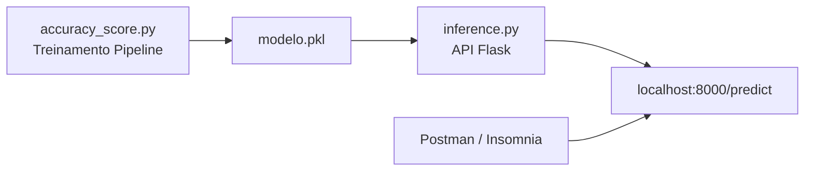

# 🚀 API de Inferência - Bank Marketing


## 📌 Visão Geral (Descrição do Problema)
Este projeto transforma um modelo de Machine Learning treinado em Python em um serviço acessível por HTTP, permitindo que aplicações externas enviem dados e recebam previsões. 

O objetivo de negócio da API é atuar no setor financeiro, prevendo se um cliente bancário irá ou não aderir a uma campanha de marketing direto focada em **depósitos a prazo**. O modelo recebe dados demográficos e econômicos do cliente via requisição POST e retorna a classificação processada pelo backend.

---

## 📊 Dataset e Variável Alvo
Os dados utilizados para o treinamento do modelo são oriundos do dataset público **Bank Marketing**, extraído do UCI Machine Learning Repository.
* 🔗 **Fonte dos Dados:** [Bank Marketing Data Set - UCI](https://archive.ics.uci.edu/ml/datasets/Bank+Marketing)

A **variável alvo** (*target*) prevista pelo modelo é a `y`, que indica a conversão final do cliente, estruturada da seguinte forma:
* `0`: Cliente **não** realizou o depósito (Representa a classe "no").
* `1`: Cliente **aderiu** à campanha (Representa a classe "yes").

---

## 🏗️ Arquitetura da Solução



## Instruções para Execução Local
1. Realize o clone do repositório para o seu ambiente.
2. Instale as bibliotecas necessárias declaradas no projeto:
   ```bash
   pip install -r requirements.txt
   ```
3. Execute o script de treinamento para ler o CSV, processar os dados e salvar o modelo serializado (`modelo.pkl`):
   ```bash
   python accuracy_score.py
   ```
4. Suba o servidor Flask responsável pelo roteamento HTTP:
   ```bash
   python inference.py
   ```
   A API iniciará a escuta em `http://127.0.0.1:8000`.

## Instruções para Testar a API
Utilize ferramentas como Insomnia ou Postman para injetar os dados de uma nova requisição.
1. Ajuste o método de envio para **POST**.
2. Insira o endereço `http://localhost:8000/predict`.
3. Na seção Body, selecione a marcação **JSON** e insira os parâmetros do cliente.

## Exemplo de Requisição e Resposta
**Corpo da Requisição (Entrada HTTP)**:
```json
[
  {
    "age": 44,
    "job": "blue-collar",
    "marital": "married",
    "education": "basic.4y",
    "default": "unknown",
    "housing": "yes",
    "loan": "no",
    "contact": "cellular",
    "month": "aug",
    "day_of_week": "thu",
    "duration": 210,
    "campaign": 1,
    "pdays": 999,
    "previous": 0,
    "poutcome": "nonexistent",
    "emp_var_rate": 1.4,
    "cons_price_idx": 93.444,
    "cons_conf_idx": -36.1,
    "euribor3m": 4.963,
    "nr_employed": 5228.1
  }
]
```

**Resposta Retornada (Saída da API)**:
```json
{
	"mensagem": "Sucesso",
	"predicao": [
		0
	]
}
```

| Nome | RM |
| :--- | :--- |
| Henrique Martins | 563620 |
| Guilherme Macedo | 562396 |
| Pedro Henrique Luiz Alves Duarte | 563405 |
